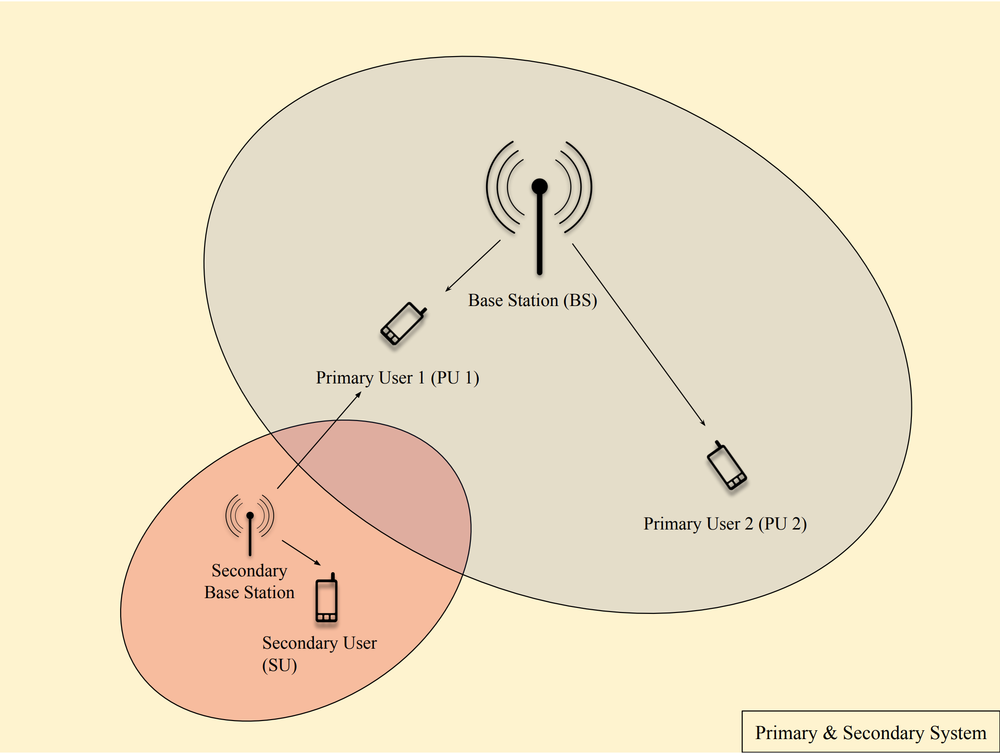
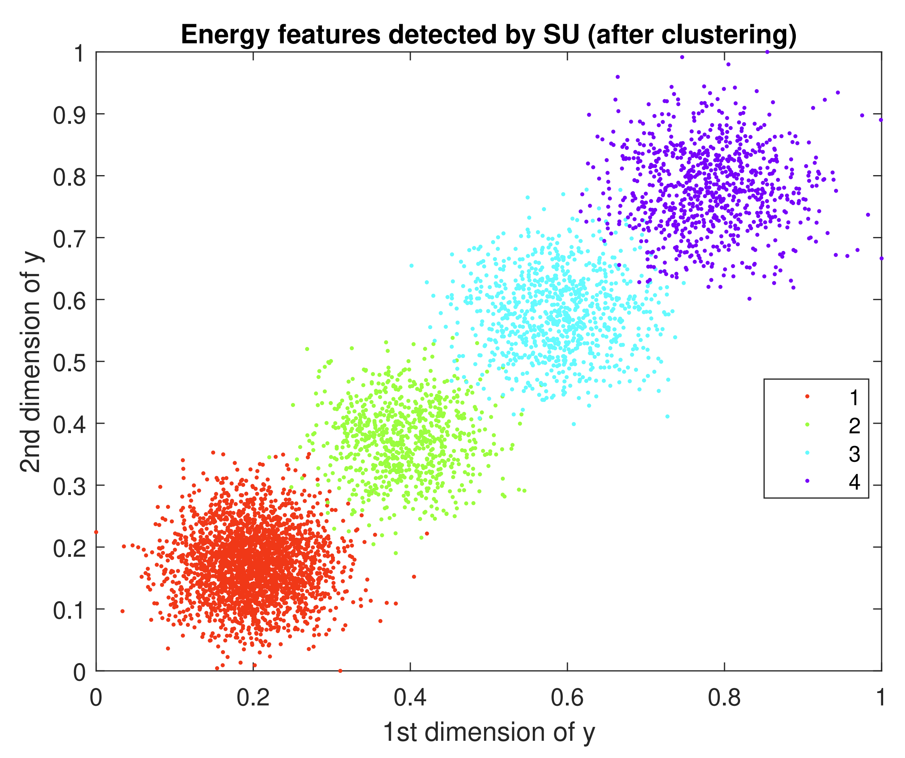

## Machine Learning aided cognitive radio networks: Spectrum sensing and resource allocation <a href="http://ikee.lib.auth.gr/record/320423/files/Diplomatiki.pdf">[pdf]</a>

<p align="left">
  
</p>

## Description
<p>In this thesis, I examined a Cognitive Radio scenario, which is a system that can be configured in a manner that it will exploit the wireless channel optimally. To be more specific, I studied the use of machine learning in cognitive radio and more specifically spectrum sensing. Therefore, I propose a system model where a primary base station operates under more than one transmit power level and transmits information messages to two primary users. A cognitive radio user attempts to perceive the environment without prior information regarding the primary transmit power levels. Before sensing, the cognitive user will first be aware of the environment from a learning phase, where the unsupervised learning algorithm (K-Means) is applied to discover base station’s transmission patterns as well as its statistics. Then, the supervised learning algorithm (Support Vector Machine and Naive Bayes) is implemented to train the cognitive radio to distinguish base station’s status based on energy feature vectors. The cognitive radio user receives from a secondary base station and the interference to the primary system is examined. Finally, taking into consideration that the secondary user introduces interference to the primary system, a method of resource allocation is proposed, in order to limit this interference. According to this method, the secondary user's transmission power is proportional to their certainty (probability) that they will interference.</p>

## Clustering
<p align="left">
  
</p>

## Citation
```bibtex
@article{Papanagnou:320423,
      author        = "Papanagnou, Anastasios ",
      title         = "{Machine Learning aided cognitive radio networks: Spectrum sensing and resource allocation}",
      year          = "2020"}
```
